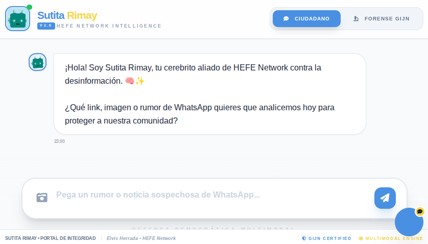
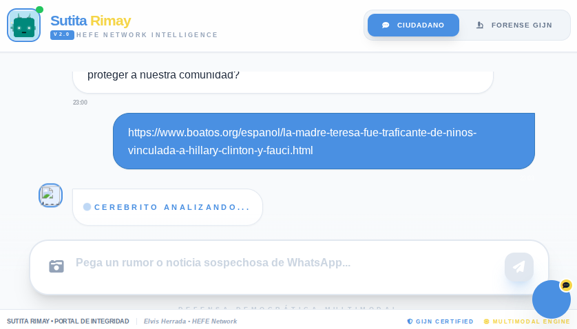
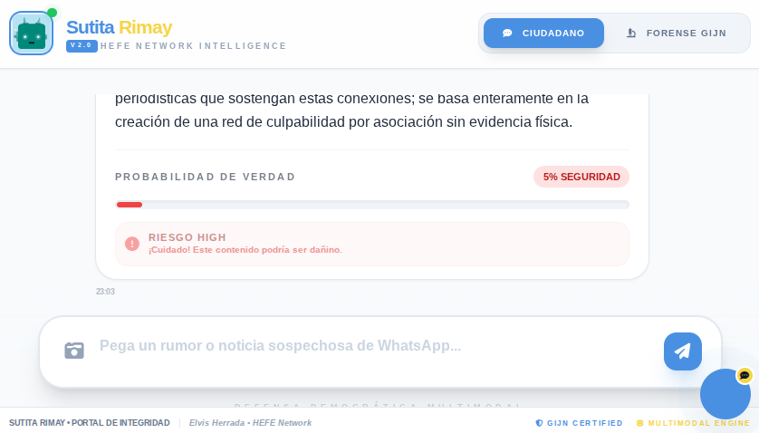
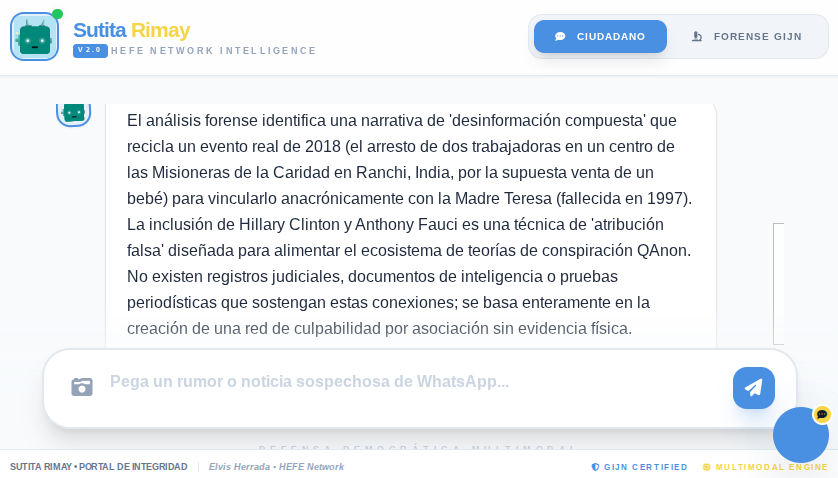

# 🛡️ SUTITA RIMAY ENGINE | HEFE NETWORK INTELLIGENCE
**Forensic AI for Action Journalism & Real-Time Verification**

### 🚀 OVERVIEW
Sutita Rimay is our specialized engine designed to detect synthetic narratives and disinformation. Powered by Google AI Studio, it serves as the technological backbone for **WP News** to protect the Westchester community from fake news.

---

### 📸 THE FORENSIC VERIFICATION PROCESS

#### 1. The Core Assistant
This is the heart of the engine, designed to be an empathetic yet rigorous ally for information verification.

#### 2. Forensic Analysis in Action
Sutita processing complex text to identify hidden agendas and potential disinformation patterns.

#### 3. Verification & Risk Assessment
The engine provides a clear risk indicator, empowering the user to identify potential threats in the narrative.

#### 4. Final Intelligent Report
The final output: A detailed forensic breakdown ready for editorial action and community alerts.

---

### 🏛️ STRATEGIC BACKING
* **Project Lead:** Elvis Herrada (Missouri RJI Fellow 2026).
* **Affiliation:** Member of the News Product Alliance (NPA).
* **Methodology:** Gemas – Transforming information into direct community action.

**White Plains News, noticias que te empoderan.**
